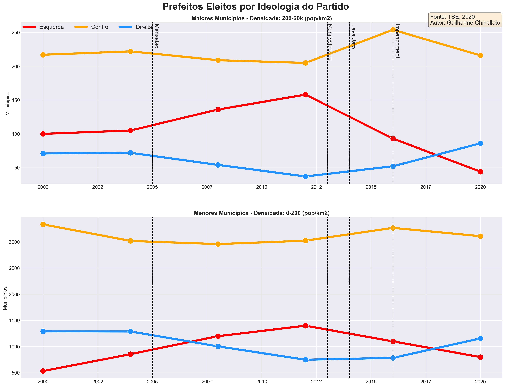
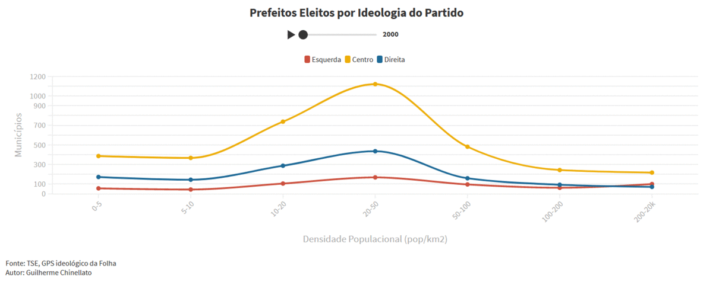
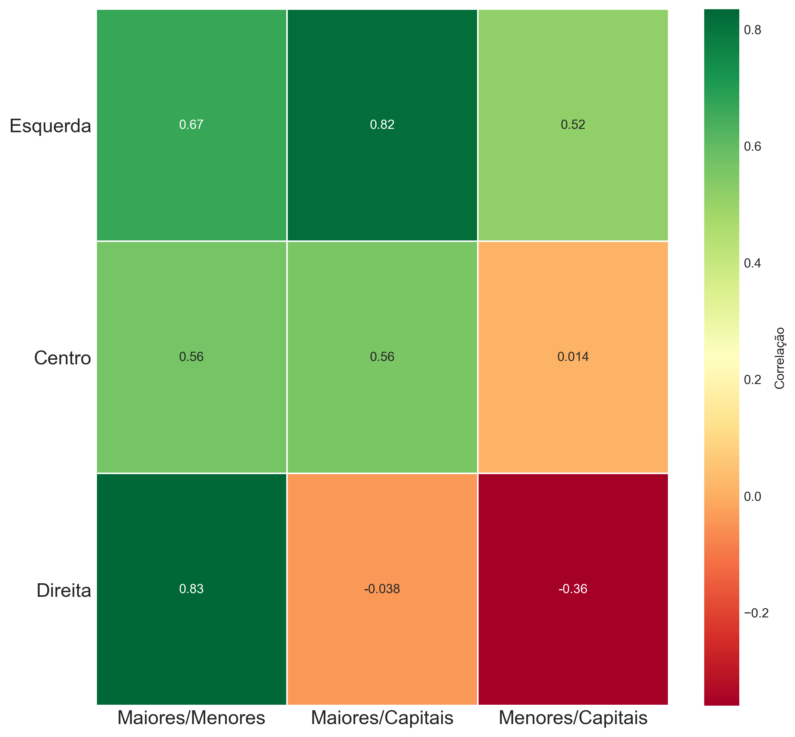
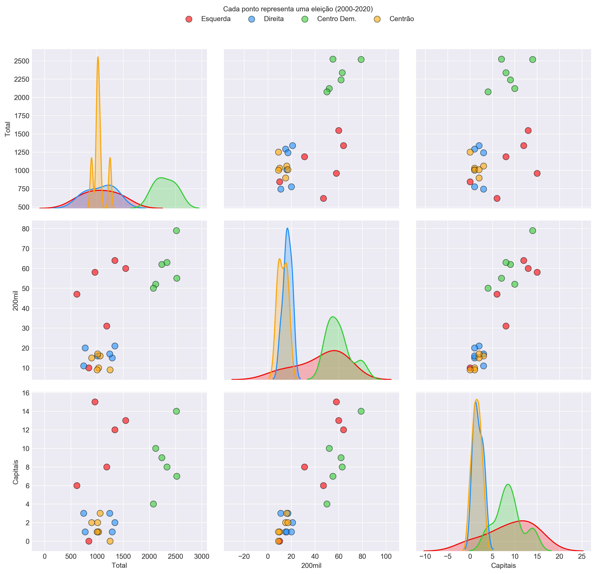
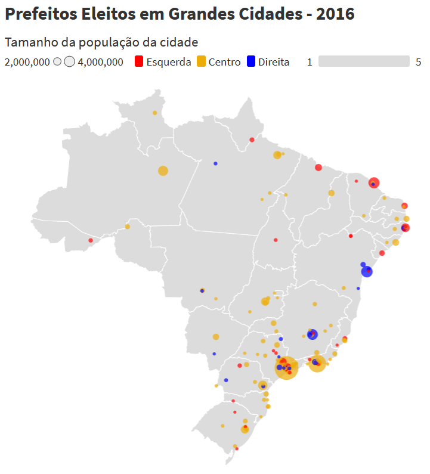

# Grandes cidades brasileiras são progressistas?
O objetivo do estudo é entender se existe algum movimento similar ao EUA em que grandes cidades tendem a ser mais *progressistas* e cidades menores mais *conservadoras*.

Para isso é analisado o total de prefeitos eleitos por partido por densidade populacional.

No cenário brasileiro é extremamente complicado definir o mapa ideológio dos partidos, por exemplo, o diretório nacional de um partido pode ter um viés mais centro/direita e o diretório estadual mais centro/esquerda. Como o autor desconhece uma forma objetiva de classificar a ideologia dos partidos por região, é utilizado o GPS ideológico da Folha: http://temas.folha.uol.com.br/gps-ideologico/

**Mapa ideológico dos partidos**

- <ins>Esquerda</ins>: PCB / PT, UP, PSOL, PSTU / PC DO B, PCO / PDT, REDE, PSB, PV
- <ins>Centro</ins>: SD, PROS, PTB / PRB, MDB, PP / PSDB, PMN, PMB / CDD, PSD
- <ins>Direita</ins>: DEM, PL, DC, AVT, PSC, PODE / PATRI / NOVO, PRTB, PSL / PTC

Uma alternativa seria utilizar o basômetro do Estadão: https://arte.estadao.com.br/politica/basometro/

O autor também entende que é uma visão simplista agrupar os partidos em um único grupo ideológico, existem diversas esquerdas (progressista, trabalhista, socialista...), centros (centro democrático e centrão) e direitas (liberal, conversadora, reacionária...), porém isso pode ser refinado no futuro.

**Cidades grandes e pequenas**

A classificação de grandes e pequenas cidades é definida utilizando os seguintes critérios:
- <ins>Grandes cidades</ins>: Municípios com densidade populacional entre 200 e 20k pop/km2 (~400 cidades)
- <ins>Pequenas cidades</ins>: Municípios com densidade populacional entre 0 e 200 pop/km2 (~5168 cidades)

**Referências**
- https://engaging-data.com/election-population-density/
- https://www.pewresearch.org/politics/interactives/political-polarization-1994-2017/
- https://news.gallup.com/poll/275792/remained-center-right-ideologically-2019.aspx
- https://www.nytimes.com/interactive/2020/11/03/us/elections/results-president.html

**Notas**

- PRN virou PTC em 2000
- PPB virou PP em abril de 2003
- PFL virou DEM em março de 2007
- PTN virou PODE em maio de 2017
- PT DO B virou AVT em setembro de 2017
- PEN virou PATRI em abril de 2018
- PMDB virou MDB em maio de 2018
- PSDC virou DC em maio de 2018
- PPS virou CDD em março de 2019
- PR virou PL em maio de 2019
- PRB virou PR em agosto de 2019
- PST, PHS, PRP, PPL, PAN e PRONA foram extintos

## Resultados
Observando o gráfico de tendência dividido por ideologia é possível notar que não existe uma grande diferença no comportamento de voto por determinada ideologia entre grandes e pequenos municípios.

Por exemplo, os partidos de **esquerda** estão em baixa desde 2012, tanto entre cidades com grande densidade populacional e cidades menores. Da mesma forma que o **centro** se manteve estável ao longo do tempo em ambos cenários, mas em 2020 perderam espaço para partidos de **direita**.

O gráfico de variação deixa evidente que o eleitorado é sazonal. Entre as eleições de 2004, 2008 e 2012 o mesmo movimento é similar nos dois cenários, porém na eleição de 2016, a **direita** conquista um grande espaço nas grandes cidades e não tanto nas cidades menores. As grandes cidades respondem de forma muita rápida manifestações nacionais, independente da ideologia, movimento que só acontece nos municípios menores na próxima eleição, como em 2020.

A hipótese de que <ins>grandes centros são mais *progressistas* no Brasil não se confirma</ins>, pois a relação entre municípios com grande e pouca densidade populacional é a mesma ao longo do tempo. O **centro** sempre como grupo político mais forte, seguido por **esquerda** e **direita** até 2016, porém em 2020, a **direita** se torna a segunda maior ideologia com prefeitos eleitos entre cidade grandes e menores.

Um fator interessante de analisar é a correlação entre cidades maiores, menores e somente capitais.
A **esquerda** possui correlação positiva nas três comparações, indicando que uma ascensão ou declínio tende a refletir em conjunto em capitais, cidades grandes e pequenas.

Porém, a **direita** não apresenta o mesmo comportamento de correlação quando capitais são envolvidas.

## Mapa Brasil por Ideologia do Partido

