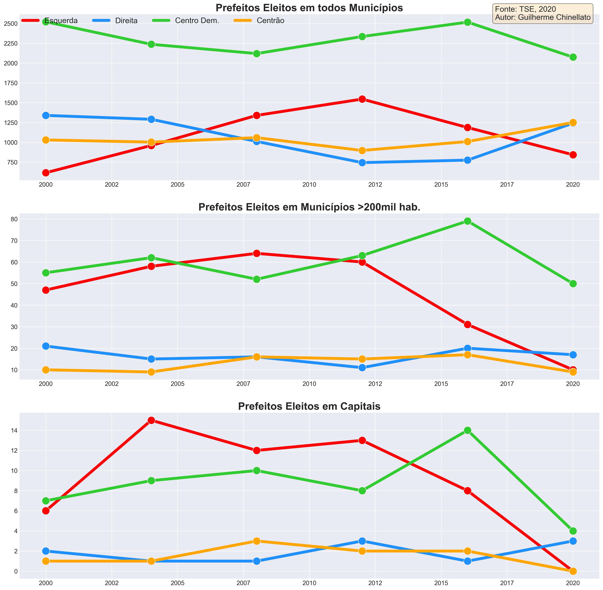
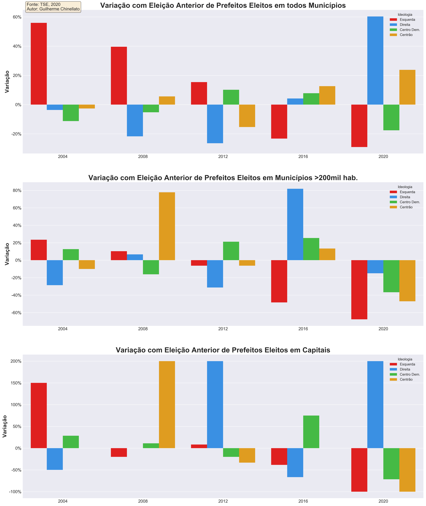

# Evolução de Prefeitos Eleitos por Partido e Ideologia
O objetivo do estudo é entender se existe algum movimento similar ao EUA em que grandes cidades tendem a ser mais *progressistas* e cidades menores mais *conservadoras*.

Para isso é analisado o total de votos para prefeito por partido em todos os municípios, municípios >200mil habitantes e somente capitais.

No cenário nacional é extremamente complicado definir o mapa ideológio dos partidos, assim será utilizado o GPS ideológico a Folha: http://temas.folha.uol.com.br/gps-ideologico/

**Mapa ideológico dos partidos**

- Esquerda: PCB / PT, UP, PSOL, PSTU / PC DO B, PCO / PDT, REDE, PSB, PV
- Centro: SD, PROS, PTB / PRB, MDB, PP / PSDB, PMN, PMB / CDD, PSD
- Direita: DEM, PL, DC, AVT, PSC, PODE / PATRI / NOVO, PRTB, PSL / PTC

Uma alternativa seria utilizar o basômetro do Estadão: https://arte.estadao.com.br/politica/basometro/

Como a categoria **Centro** é muito ampla pelo fisiologismo dos partidos, o autor deste estudo se permite dividir a categoria entre **Centrão** e **Centro Democrático**. Por mais que essa classificação seja subjetiva, é algo que pode ser refinado no futuro.

- Centrão: SD, PROS, PTB / PRB, PP / PMN, PMB
- Centro Dem: MDB / PSDB / CDD, PSD

**Referências**

- https://www.pewresearch.org/politics/interactives/political-polarization-1994-2017/
- https://news.gallup.com/poll/275792/remained-center-right-ideologically-2019.aspx
- https://www.nytimes.com/interactive/2020/11/03/us/elections/results-president.html

**Notas**

- PRN virou PTC em 2000
- PPB virou PP em abril de 2003
- PFL virou DEM em março de 2007
- PTN virou PODE em maio de 2017
- PT DO B virou AVT em setembro de 2017
- PEN virou PATRI em abril de 2018
- PMDB virou MDB em maio de 2018
- PSDC virou DC em maio de 2018
- PPS virou CDD em março de 2019
- PR virou PL em maio de 2019
- PRB virou PR em agosto de 2019
- PST, PHS, PRP, PPL, PAN e PRONA foram extintos

## Resultados
Observando o gráfico de tendência dividido por ideologia é possível observar que não existe uma grande diferença no comportamento de voto por determinada ideologia.

Por exemplo, os partidos de **esquerda** estão em baixa desde 2012, tanto no conjunto total de municípios, municípios >200mil e em capitais. Da mesma forma que o **centro democrático** se manteve estável ao longo do tempo nos três cenários, mas em 2020 perdeu espaço para partidos de **direita** e **centrão**.

O gráfico de variação deixa evidente que não existe um padrão constante. Entre a eleição de 2008 o mesmo movimento é similar nos três cenários, porém na eleição de 2012, a **direita** ganha muita força nas capitais e perde nas cidades menores, <ins>anulando a hipótese de que grande centros são mais *progressistas*</ins>. As grandes cidades respondem de forma muita rápida manifestações nacionais, independente da ideologia, movimento que só acontece nos municípios menores na próxima eleição, como em 2016.

A movimentação dos partidos de **esquerda** tem forte correleção nos três cenários. A ascensão da **esquerda** é refletida simultaneamente nas capitais e municípios menores. O **centro democrático** apresenta o mesmo comportamento.

Porém, a **direita** possui correlação neutra nos três cenários, não sendo possível determinar um padrão de ascensão ou declínio entre grandes centros e cidades menores.

Já o **centrão** apresenta correlação negativa entre o total de municípios e municípios >200mil hab., indicando que quando o **centrão** se fortalece nas cidades menores, se enfraquece nas cidades grandes, mas quando se fortalece em municípios >200mil hab., também se fortalece nas capitais.

## Próximos passos
Mapa de calor do Brasil com quantidade de votos em prefeitos com determinada ideologia do partido.
