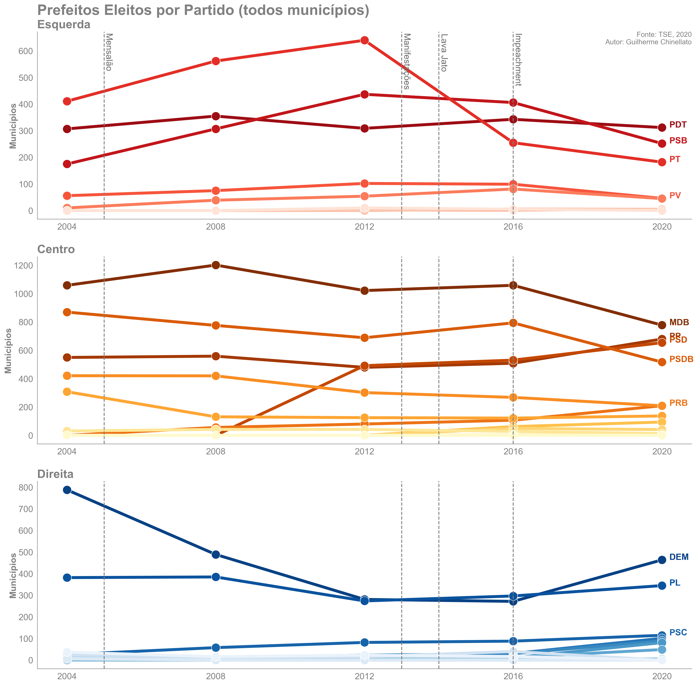

# Grandes cidades brasileiras são progressistas?
O objetivo do estudo é entender se existe algum movimento similar ao EUA em que grandes cidades tendem a ser mais *progressistas* e cidades menores mais *conservadoras*.

Para isso é analisado o total de prefeitos eleitos por partido por demografia populacional.

No cenário brasileiro é extremamente complicado definir o mapa ideológico dos partidos, por exemplo, o diretório nacional de um partido pode ter um viés mais centro/direita e o diretório estadual mais centro/esquerda.
Como o autor desconhece uma forma objetiva de classificar a ideologia dos partidos por região, é utilizado o GPS ideológico da Folha: http://temas.folha.uol.com.br/gps-ideologico/

**Mapa ideológico dos partidos**

- <ins>Esquerda</ins>: PCB / PT, UP, PSOL, PSTU / PC DO B, PCO / PDT, REDE, PSB, PV
- <ins>Centro</ins>: SD, PROS, PTB / PRB, MDB, PP / PSDB, PMN, PMB / CDD, PSD
- <ins>Direita</ins>: DEM, PL, DC, AVT, PSC, PODE / PATRI / NOVO, PRTB, PSL / PTC

Uma alternativa seria utilizar o basômetro do Estadão: https://arte.estadao.com.br/politica/basometro/

O autor também entende que é uma visão simplista agrupar os partidos em um único grupo ideológico, existem diversas esquerdas (progressista, trabalhista, socialista...), centros (centro democrático e centrão) e direitas (liberal, conversadora, reacionária...), porém isso pode ser refinado no futuro.

**Cidades grandes e pequenas**

A classificação de grandes e pequenas cidades é definida utilizando os seguintes critérios:
- <ins>Cidade Grande</ins>: Municípios com população >500mil habitantes (49)
- <ins>Cidade Média</ins>: Municípios com população entre 100mil e 500mil habitantes (277)
- <ins>Cidade Pequena</ins>: Municípios com população <100mil habitantes (5244)

**Referências**
- https://engaging-data.com/election-population-density/
- https://www.pewresearch.org/politics/interactives/political-polarization-1994-2017/
- https://news.gallup.com/poll/275792/remained-center-right-ideologically-2019.aspx
- https://www.nytimes.com/interactive/2020/11/03/us/elections/results-president.html

**Notas**

- PRN virou PTC em 2000
- PPB virou PP em abril de 2003
- PFL virou DEM em março de 2007
- PTN virou PODE em maio de 2017
- PT DO B virou AVT em setembro de 2017
- PEN virou PATRI em abril de 2018
- PMDB virou MDB em maio de 2018
- PSDC virou DC em maio de 2018
- PPS virou CDD em março de 2019
- PR virou PL em maio de 2019
- PRB virou PR em agosto de 2019
- PGT, PST, PHS, PRP, PPL, PAN e PRONA foram extintos

## Resultados
Observando o gráfico de tendência dividido por ideologia é possível notar que não existe uma grande diferença no comportamento de voto por determinada ideologia entre grandes e pequenos municípios ao longo do tempo.

Por exemplo, os partidos de **esquerda** tinham uma força em grandes cidades, mas estão em baixa desde 2016, tanto entre cidades grandes, médias e pequenas. Da mesma forma que o **centro** se manteve estável ao longo do tempo em ambos cenários, mas a partir de 2016 perdeu espaço para partidos de **direita** em cidades médias e pequenas.

O gráfico de variação deixa evidente que o eleitorado é sazonal. Existem períodos que a **esquerda** e **direita** se fortalecem em grandes cidades, como em 2004, mas desde 2016 a **direita** cresceu muito em cidades médias e pequenas, enquanto a **esquerda** se enfraqueceu muito.

A hipótese de que <ins>grandes centros são mais *progressistas* no Brasil não se confirma</ins>, pois a relação entre municípios grandes, médios e pequenos varia ao longo do tempo. O **centro** sempre como ideologia principal no país, porém entre 2000-2012 a **esquerda** apresenta uma maior força em grandes cidades e cidades pequenas ficam divididas entre **centro** e **direita**. A partir de 2016 a **esquerda** derrete em todos os cenários e o **centro** se fortalece muito, onde em 2020 esse movimento continua com a **direita** aumentando sua participação de forma proporcional em cidades grandes e pequenas.

Atualmente, nas grandes cidades, o **centro** representa 67%, **direita** 28% e **esquerda** 5%.

O partido com mais prefeitos eleitos da **esquerda** é o PDT, com destaque para o PT que continua em plena queda desde 2016. Entre o **centro**, os principais partidos são MDB, PP e PSD e na **direita** o DEM está em ascensão.

Um fator interessante de analisar é a correlação entre cidades grandes, médias e pequenas.
A **esquerda** possui correlação positiva nas três comparações, indicando que uma ascensão ou declínio tende a refletir em conjunto em capitais, cidades grandes e pequenas. Porém, a **direita** não apresenta o mesmo comportamento de correlação quando grandes cidades são envolvidas.

## Mapa do Brasil por Ideologia do Partido

